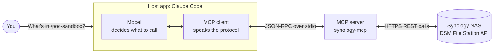
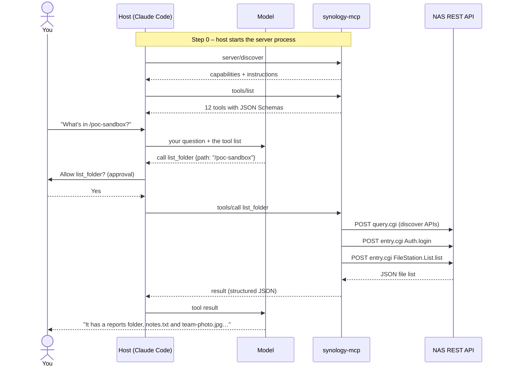

# What is an MCP server? A guide for web developers

*For developers who know REST APIs and basic web development but haven't worked with MCP. Every example is real traffic from this repo's Synology server; the full, unedited messages are in [mcp-wire-sample.md](mcp-wire-sample.md).*

## MCP in one paragraph

**MCP (Model Context Protocol)** is a standard way for an AI application, such as Claude Code or Claude Desktop, to discover and call tools that live outside the AI. An **MCP server** is a small program that says "here are the things I can do, and here's the input each one takes", and then does them when asked. If you know REST, think of it as **an API whose caller is an AI model**: discovery (like an OpenAPI spec) and invocation (like a POST) are built into one protocol, so any MCP-capable app can use any MCP server without custom glue code.

This repo's server, `synology-mcp`, wraps a Synology NAS. The NAS already has a REST-style API, and the MCP server translates between "the AI wants to list a folder" and the NAS's HTTP calls.

## Who's involved



| Role | In this PoC | Web analogy |
|------|-------------|-------------|
| **Host** | Claude Code (or Claude Desktop, MCP Inspector) | The browser |
| **MCP client** | The connection the host keeps to each server | `fetch()` / an HTTP client library |
| **MCP server** | `synology-mcp` ([server.py](../src/synology_mcp/server.py)) | A backend API service |
| **Model** | Claude, deciding which tool to call and with what arguments | The developer writing the API calls, except now it happens at run time |
| **Upstream system** | The NAS and its File Station REST API | A third-party API your backend calls |

The key difference from REST is in the last rows. With REST, **your code** decides which endpoint to call. With MCP, **the model** reads the tool descriptions and decides, and the host asks you for permission before the call runs.

## REST vs MCP, side by side

| | REST API | MCP server |
|---|---|---|
| Addressing | Many URLs plus HTTP verbs (`GET /files`, `POST /folders`) | One connection; the operation is named in the message (`"method": "tools/call"`, `"name": "list_folder"`) |
| Message format | Anything, usually JSON bodies | Always **JSON-RPC 2.0**: `{"jsonrpc": "2.0", "id": 3, "method": "…", "params": {…}}` |
| Transport | HTTP | **stdio**: the host starts the server as a child process and they exchange one JSON message per line over stdin/stdout. Remote servers use HTTP instead. |
| Discovery | Optional (OpenAPI/Swagger, if someone wrote it) | Built in: `tools/list` returns every tool with a description and a JSON Schema for its input |
| Who calls it | Your code, written in advance | A model, at run time, from the descriptions, with user approval |
| Errors | HTTP status codes (`403`, `404`, `500`) | Tool failures come back as a normal **result** with `"isError": true` and a readable message the model can act on |
| Credentials | Sent by every client (API key, token) | Kept **inside the server**. The model never sees the NAS password. |

## The three building blocks

An MCP server can offer three kinds of things. This one uses two.

- **Tools**: actions the model can call, roughly like POST endpoints. Examples: `list_folder`, `search_files`, `get_thumbnail`, and (when enabled) `create_folder` and `delete`.
- **Prompts**: ready-made task templates the user picks, like a saved request in Postman. Ours: `audit_access`, `find_large_files`, `clean_sandbox`. In Claude Code they show up as slash commands, e.g. `/mcp__synology__find_large_files`.
- **Resources**: read-only data the host can attach as context, roughly like GET-able documents. This server doesn't define any.

---

## Walkthrough: "What's in /poc-sandbox?"

Here's every step of one real request, from your question to the answer.



### Step 0: the host starts the server

You register the server once:

```bash
claude mcp add synology -- uv run --directory /path/to/repo synology-mcp
```

That's just a command line. When a Claude Code session starts, it **launches that command as a child process** and keeps its stdin/stdout open. There's no port and no URL: messages flow through the process's pipes, one JSON object per line. The server reads its NAS credentials from the repo's `.env`, so they never pass through the host or the model.

### Step 1: discovery handshake

The client's first message asks the server what it supports. In the current protocol version (`2026-07-28`) that's `server/discover`; older versions used a method called `initialize`. Excerpt (full in the [appendix](mcp-wire-sample.md#1-connecting-handshake)):

```json
{"jsonrpc": "2.0", "id": 1, "method": "server/discover",
 "params": {"_meta": {"io.modelcontextprotocol/protocolVersion": "2026-07-28", "…": "…"}}}
```

The server answers with its capabilities (tools, prompts, resources) and **instructions**, a short text the host gives the model about how to use this server:

```json
{"jsonrpc": "2.0", "id": 1, "result": {
  "capabilities": {"tools": {"listChanged": true}, "prompts": {"listChanged": true}, "…": "…"},
  "instructions": "Tools for a Synology NAS via the File Station API. Paths are absolute and start with a shared folder, e.g. /poc-sandbox/reports/q3.pdf. Writes are disabled. Share links are disabled. …"
}}
```

> **REST analogy:** every request carries the protocol version and client info in `_meta`, much like HTTP headers (`User-Agent`, `Accept`), so each request is self-describing. The `id` pairs a response with its request, since many requests can share one pipe.

### Step 2: the tool catalog (`tools/list`)

The host asks which tools exist. Each tool comes back with a **name**, a **description** for the model, a **JSON Schema** for its input, and **annotations** (hints such as "read-only"). Here's `list_folder`, trimmed:

```json
{
  "name": "list_folder",
  "description": "List a folder. sort_by: name|size|mtime|type; filetype: all|file|dir; pattern: glob like *.pdf.\nSystem folders (#recycle, @eaDir) are hidden unless include_system is true.",
  "inputSchema": {
    "type": "object",
    "properties": {
      "path":   {"title": "Path",  "type": "string"},
      "limit":  {"title": "Limit", "type": "integer", "default": 100},
      "pattern":{"title": "Pattern", "anyOf": [{"type": "string"}, {"type": "null"}], "default": null},
      "…": "…"
    },
    "required": ["path"]
  },
  "annotations": {"readOnlyHint": true, "openWorldHint": false}
}
```

Nobody wrote that JSON by hand. The SDK **generated it from an ordinary Python function**: the type hints became the schema, and the docstring became the description. From [server.py](../src/synology_mcp/server.py):

```python
@tool(READ_ONLY)
def list_folder(path: str, offset: int = 0, limit: int = 100, sort_by: str = "name",
                sort_direction: str = "asc", pattern: str | None = None,
                filetype: str = "all", include_system: bool = False) -> dict[str, Any]:
    """List a folder. sort_by: name|size|mtime|type; filetype: all|file|dir; pattern: glob like *.pdf.
    System folders (#recycle, @eaDir) are hidden unless include_system is true."""
    data = session.fs().list_folder(path, offset=offset, limit=limit, ...)
    return {"total": data["total"], "items": [...]}
```

> **REST analogy:** this is your OpenAPI spec, served live by the API itself and always in sync with the code. The description matters more than in a typical REST API, because a model reads it to decide **when** to use the tool.

### Step 3: the model chooses and you approve

You type *"What's in /poc-sandbox?"*. The host sends your message, plus the tool catalog, to the model. The model replies with a request to call `list_folder` with `{"path": "/poc-sandbox"}`, not with text. The host shows you that call and asks for permission before anything reaches the server.

### Step 4: the tool call (`tools/call`)

```json
{"jsonrpc": "2.0", "id": 3, "method": "tools/call",
 "params": {"name": "list_folder", "arguments": {"path": "/poc-sandbox"}}}
```

> **REST analogy:** roughly `POST /tools/list_folder` with body `{"path": "/poc-sandbox"}`. The server validates `arguments` against the schema it published in step 2.

### Step 5: inside the server, real REST calls

This is where MCP meets the REST world. The server's tool function calls the project's Python library (`FileStation.list_folder`), which makes ordinary HTTPS calls to the NAS. This is the first tool call, so the server also discovers the NAS APIs and logs in first. Captured (session ID and password redacted):

```http
POST https://fakenas.local:5001/webapi/query.cgi
  api=SYNO.API.Info  method=query  version=1  query=all

POST https://fakenas.local:5001/webapi/entry.cgi
  api=SYNO.API.Auth  method=login  version=7
  account=poc-user  passwd=<redacted>  session=FileStation  format=sid

POST https://fakenas.local:5001/webapi/entry.cgi
  api=SYNO.FileStation.List  method=list  version=2
  folder_path=/poc-sandbox  offset=0  limit=100  sort_by=name  sort_direction=asc
  filetype=all  additional=["size", "time", "type"]  _sid=<redacted>
```

The NAS answers with its own JSON (`{"success": true, "data": {"files": [...]}}`). The server reshapes it into something compact for the model: it hides the `#recycle` system folder, converts timestamps to ISO dates, and drops fields the model doesn't need. Later tool calls reuse the same NAS session, and the server logs out when it shuts down.

### Step 6: the result goes back

```json
{"jsonrpc": "2.0", "id": 3, "result": {
  "isError": false,
  "structuredContent": {
    "total": 4, "hidden_system": 1,
    "items": [
      {"name": "notes.txt", "path": "/poc-sandbox/notes.txt", "is_dir": false, "size": 32, "type": "TXT", "…": "…"},
      {"name": "reports", "path": "/poc-sandbox/reports", "is_dir": true, "…": "…"},
      {"name": "team-photo.jpg", "path": "/poc-sandbox/team-photo.jpg", "is_dir": false, "size": 210002, "type": "JPG", "…": "…"}
    ]},
  "content": [{"type": "text", "text": "{\n  \"total\": 4, … (the same data as text)"}]
}}
```

A result carries the data twice: as **structured JSON** (`structuredContent`) and as **text** (`content`) for hosts that only show text. The host gives it to the model, which answers you in plain language: *"/poc-sandbox has a `reports` folder, `notes.txt` (32 bytes) and `team-photo.jpg` (about 205 KB)."*

That's the whole loop: **discover → list tools → model picks → you approve → call → server does real work → result → answer.**

---

## Example 2: a refused write

Write tools exist only if the server is started with `SYNO_MCP_ALLOW_WRITES=true`, and even then only inside the allowed folders (`/poc-sandbox`). Here the model tries to create a folder in `/video`:

```json
{"jsonrpc": "2.0", "id": 2, "method": "tools/call",
 "params": {"name": "create_folder", "arguments": {"parent": "/video", "name": "holiday"}}}
```

```json
{"jsonrpc": "2.0", "id": 2, "result": {
  "isError": true,
  "content": [{"type": "text",
    "text": "Error executing tool create_folder: Refused by policy: '/video' is outside the allowed roots: /poc-sandbox"}]
}}
```

Two things to notice:

- **It's a normal result, not an HTTP-style error.** There's no 403. The failure is data, with `isError: true` and a sentence the model can read, explain to you, and adapt to (e.g. by suggesting `/poc-sandbox/holiday`). JSON-RPC's own `error` object is kept for protocol problems such as an unknown method or malformed message.
- **The NAS was never contacted.** The server's `PathPolicy` ([policy.py](../src/synology_poc/policy.py)) rejected the path before any REST call. The safety rules live in the server, where neither the model nor a prompt can talk its way around them.

## Example 3: a prompt

Prompts are reusable task templates the **user** triggers. In Claude Code, typing `/mcp__synology__find_large_files` sends:

```json
{"jsonrpc": "2.0", "id": 4, "method": "prompts/get",
 "params": {"name": "find_large_files", "arguments": {"folder": "/poc-sandbox", "top": "5"}}}
```

The server answers with instructions, not data:

```json
{"result": {"messages": [{"role": "user", "content": {"type": "text",
  "text": "Find the 5 largest files under /poc-sandbox on the NAS.\n1. Call folder_size for /poc-sandbox …\n2. Call search_files with folder=/poc-sandbox, filetype=file, max_results=500.\n3. Sort the results by size and show the top 5 as a table … Don't change anything on the NAS."}}]}}
```

The host puts that text into the conversation as if you'd typed it. The model then makes the tool calls it describes (`folder_size`, then `search_files`), and each one goes through steps 3–6 above, approvals included. A prompt is a shortcut for *asking*; it never bypasses the tools' rules.

---

## How this PoC keeps it safe

| Layer | What it does |
|-------|--------------|
| A dedicated NAS account | The server logs in as a **non-admin** user that can see only `/poc-sandbox` and its own home folder. Whatever the AI does, it can't exceed that account. |
| Credentials stay in the server | The password lives in `.env` on your machine and goes only to the NAS. It's never in a tool result, the host config, or the model's context. |
| Tools hidden until enabled | With the default settings, the 7 write tools and 3 share-link tools **aren't even listed**; the model sees 12 read-only tools. |
| Policy checks | Every write is checked against the allowed folders, including `..` tricks, before any NAS call. |
| Approvals and annotations | The host asks you before tool calls. Annotations (`readOnlyHint`, `destructiveHint`) let it warn you more strongly about deletes. |

## Try it yourself

- **See the raw protocol:** `npx @modelcontextprotocol/inspector uv run --directory /path/to/repo synology-mcp` opens a web UI where you call tools by hand and watch the JSON.
- **Regenerate the captured traffic:** `uv run python scripts/capture_mcp_wire.py`. It runs the real server against a fake NAS and rewrites [mcp-wire-sample.md](mcp-wire-sample.md).
- **Set it up for real:** [mcp-server.md](mcp-server.md). For what each tool does on the NAS: [use-cases.md](use-cases.md).

## Glossary

| Term | Meaning |
|------|---------|
| **MCP** | Model Context Protocol, an open standard for connecting AI apps to tools and data |
| **Host** | The AI application the user works in (Claude Code, Claude Desktop) |
| **MCP client** | The host's connection to one server |
| **MCP server** | A program that offers tools, prompts and resources over MCP (`synology-mcp`) |
| **Tool** | A named action with a JSON Schema input; called via `tools/call` |
| **Prompt** | A named, parameterized message template; fetched via `prompts/get` |
| **Resource** | Read-only data a server exposes for context (not used here) |
| **JSON-RPC 2.0** | The message format: `method` + `params` in, `result` or `error` out, matched by `id` |
| **stdio transport** | Messages exchanged as JSON lines over a child process's stdin/stdout |
| **Annotations** | Hints about a tool's behavior (read-only, destructive) that hosts use for warnings |
| **Upstream API** | The system the server calls to do the work; here, the NAS's File Station REST API |
